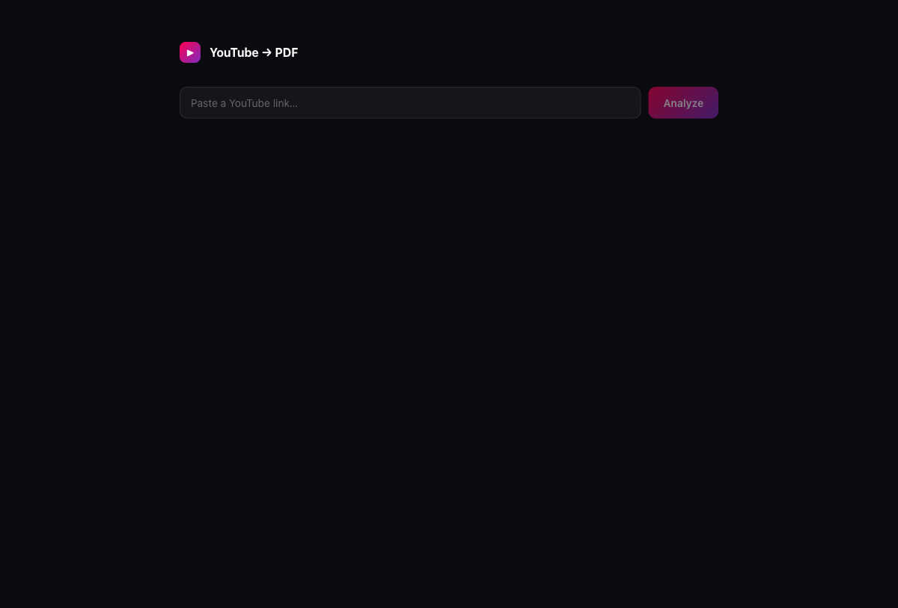
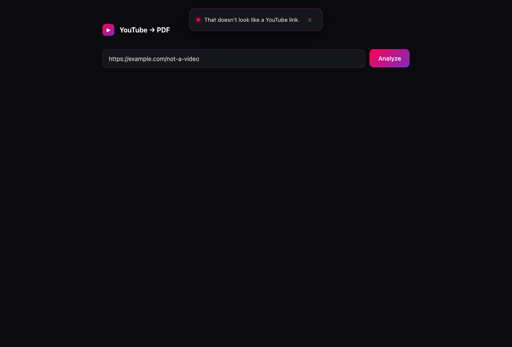
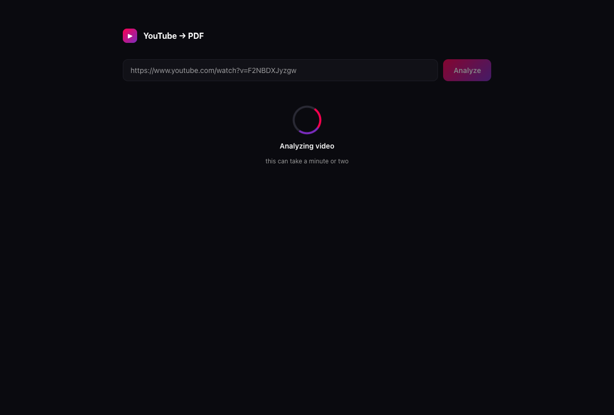
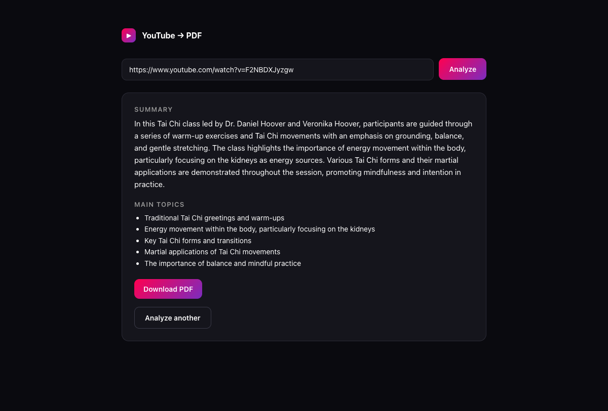
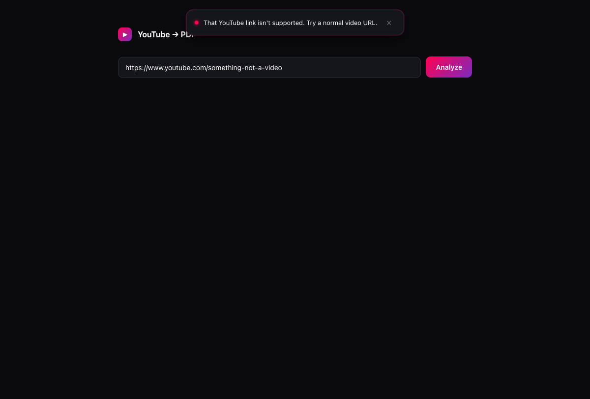

# YouTube → PDF

> Paste a YouTube link, click Analyze, get a one-page resume on screen and a polished PDF report you can download.

A small web app that turns any YouTube video into a structured summary + main-topics list + downloadable PDF. Built as a thin, focused web front end around an existing Python pipeline that handles caption fetching, audio fallback transcription, LLM summarization, and PDF rendering.



---

## Table of contents

- [What it does](#what-it-does)
- [Screenshots — full user flow](#screenshots--full-user-flow)
- [Architecture](#architecture)
- [Data flow](#data-flow)
- [Tools used](#tools-used)
- [Project layout](#project-layout)
- [Prerequisites](#prerequisites)
- [Setup](#setup)
- [Running it](#running-it)
- [Testing](#testing)
- [Notes](#notes)

---

## What it does

1. You paste a YouTube URL into a single input.
2. The backend pulls the transcript:
   - first via the YouTube transcript API,
   - then falls back to `yt-dlp` subtitles,
   - then, if neither exists, downloads the audio and uses OpenAI's transcription model.
3. The transcript is summarized via the OpenAI Responses API, producing a structured payload (`summary`, `main_topics`, `prompt_examples`, `actionable_tips`).
4. A multi-page PDF is rendered with Pillow and saved to disk.
5. The UI shows the summary + main topics, and a **Download PDF** button.

Errors never leak raw backend messages to the user — every failure surfaces as a friendly top toast (e.g. "We couldn't get a transcript for this video. Try a different one.").

---

## Screenshots — full user flow

| State | Screenshot |
|---|---|
| **Idle** — dark canvas, gradient brand mark, empty input |  |
| **Bad URL** — paste anything that isn't a YouTube link, click Analyze → a friendly top toast appears, **no API call is made**, the toast auto-dismisses after 4s |  |
| **Loading** — gradient ring spinner animates as long as the backend is working. No fake progress, just honest motion |  |
| **Success** — summary paragraph, bulleted main topics, gradient Download PDF button, outlined "Analyze another" reset |  |
| **Server error** — YouTube URL that the pipeline can't handle (e.g. no video ID) returns 400; the UI maps it to a friendly, non-technical toast |  |

---

## Architecture

Two cleanly separated processes during development, fused into one in production.

```
┌──────────────────────────────────────────────────────────────────────┐
│                            Browser                                   │
│                                                                      │
│   React 18 + TypeScript (Vite-built static bundle)                   │
│   ─ App.tsx           state machine: idle / loading / success        │
│   ─ AnalyzeForm.tsx   URL input + Analyze button                     │
│   ─ Spinner.tsx       animated gradient ring (CSS-only)              │
│   ─ ResultCard.tsx    summary + topics + Download PDF link           │
│   ─ Toast.tsx         friendly error popup, auto-dismiss in 4s       │
│   ─ api.ts            single fetch call site, throws HttpError       │
└────────────────────────────────┬─────────────────────────────────────┘
                                 │ HTTP (relative URLs:
                                 │   /api/analyze, /pdfs/<file>)
                                 ▼
┌──────────────────────────────────────────────────────────────────────┐
│   FastAPI backend (uvicorn, Python 3.11+)                            │
│                                                                      │
│   ─ app/main.py      create_app() factory, CORS, static mounts       │
│   ─ app/api.py       POST /api/analyze, GET /api/health,             │
│                      maps ValueError→400, RuntimeError→502,          │
│                      anything else → 500 with error_id               │
│   ─ app/schemas.py   AnalyzeRequest, AnalyzeResponse                 │
│   ─ app/service.py   thin wrapper around the pipeline package        │
│   ─ app/settings.py  pydantic-settings, loads .env                   │
│                                                                      │
│   StaticFiles mounts:                                                │
│     /pdfs/*   →  backend/exports/                                    │
│     /*        →  frontend/dist/  (when built)                        │
└────────────────────────────────┬─────────────────────────────────────┘
                                 │ Python import (editable install)
                                 ▼
┌──────────────────────────────────────────────────────────────────────┐
│   youtube_pdf_reporter  (separate package, sibling on disk)          │
│                                                                      │
│   YouTubeAnalyzer.analyze(url):                                      │
│      ① YouTube Transcript API   (preferred — fast, no download)      │
│      ② yt-dlp subtitle fallback (when captions aren't exposed)       │
│      ③ yt-dlp audio + OpenAI    (when both subtitle paths fail)      │
│         transcription model                                          │
│      ④ OpenAI Responses API     (summary + topics + extracted info)  │
│                                                                      │
│   export_analysis_pdf(analysis, dir) → multi-page PDF via Pillow     │
└──────────────────────────────────────────────────────────────────────┘
```

**Key boundaries:**
- The **front end never talks to OpenAI directly** — everything goes through the backend's `/api/analyze`.
- The **backend never embeds pipeline logic** — `app/service.py` is the only file that imports `youtube_pdf_reporter`, and it's ~20 lines.
- The **error envelope is fixed at the HTTP layer** — `api.py` translates Python exceptions into HTTP status codes; the front end maps those status codes to user-facing copy in `App.tsx::messageForError`.

---

## Data flow

End-to-end for a single analyze request:

```
User pastes URL  ──▶  AnalyzeForm validates non-empty
                          │
                          ▼
              App.handleSubmit(url)
                          │
                          ├─ looksLikeYouTubeUrl(url) === false
                          │       ──▶  setToast("That doesn't look like a YouTube link.")
                          │            (no API call, no spinner)
                          │
                          └─ valid-looking → setStatus({ kind: "loading" })
                                          │
                                          ▼
                       fetch POST /api/analyze
                                          │
                          ┌───────────────┴────────────────┐
                          │                                │
                   2xx success                       non-2xx
                          │                                │
                          ▼                                ▼
            setStatus({ kind: "success",        throw HttpError(status, detail)
                       data })                              │
                          │                                 ▼
                          ▼                  App.catch → setStatus({ idle })
                ResultCard shows                            │
                summary + topics                            ▼
                + Download PDF link               setToast(messageForError(e))
                          │                                 │
                          ▼                                 ▼
              click Download                  Toast slides down from top,
              GET /pdfs/<file>.pdf            auto-dismisses after 4s
              (FastAPI StaticFiles)
```

Backend pipeline for `POST /api/analyze`:

```
extract_video_id(url)
    │
    ├─ invalid URL → raise ValueError → HTTP 400
    │
    ▼
fetch transcript
    │  ① youtube-transcript-api
    │  ② yt-dlp subtitles (vtt → plain text)
    │  ③ yt-dlp audio download → OpenAI transcription
    │
    ├─ all three fail → raise RuntimeError → HTTP 502
    │
    ▼
OpenAI Responses API summarization
    │  (chunked + synthesized for long transcripts, MAX_ANALYSIS_CHARS = 45 000)
    │
    ▼
VideoAnalysis (summary, main_topics, prompt_examples, actionable_tips)
    │
    ▼
export_analysis_pdf(analysis, exports_dir)
    │  Pillow renders pages with system Arial Unicode font
    │
    ▼
return { video_id, summary, main_topics, pdf_url, pdf_filename }
```

---

## Tools used

| Layer | Tool | Why |
|---|---|---|
| **Frontend framework** | React 18 + TypeScript | Type-safe components, mature ecosystem, the user already knew it |
| **Build tool** | Vite 5 | Fast HMR in dev, single-command static build for prod, dev proxy support |
| **Frontend testing** | Vitest + @testing-library/react | Same config as Vite, browser-like DOM via jsdom, role-based queries |
| **Styling** | Plain CSS with custom properties | No Tailwind, no UI library — theme tokens in `:root`, dark-mode by default. Total CSS bundle: ~4 KB gzipped |
| **HTTP client** | Native `fetch` | One call site, no axios. Throws typed `HttpError` so the App can map status → message |
| **Backend framework** | FastAPI + Uvicorn | Async-capable Python, automatic OpenAPI, ergonomic dependency injection, `StaticFiles` mount |
| **Validation / settings** | Pydantic v2 + pydantic-settings | Request/response schemas, env loading with validators, fail-fast on missing `OPENAI_API_KEY` |
| **Backend testing** | pytest + FastAPI `TestClient` | One process, no real network, fast (~0.5s for 15 tests) |
| **Pipeline (separate package)** | OpenAI SDK, youtube-transcript-api, yt-dlp, Pillow | Captions → transcript fallback → audio fallback → LLM summary → PDF |
| **Process orchestration (dev)** | `make` + `npx concurrently` | `make dev` runs backend (`:8000`) and frontend (`:5173`) in parallel |
| **Process orchestration (prod)** | Single Uvicorn process | Serves API at `/api/*`, PDFs at `/pdfs/*`, and the built React app at `/*` |

---

## Project layout

```
youtube_pdf_reporter_ui/
├── README.md                   ← you are here
├── Makefile                    ← dev / build / run / test targets
├── .env.example                ← copy to backend/.env and fill in OPENAI_API_KEY
├── .gitignore
├── docs/
│   ├── screenshots/            ← screenshots referenced by this README
│   └── superpowers/            ← design specs + implementation plans
│       ├── specs/
│       └── plans/
├── backend/
│   ├── pyproject.toml          ← FastAPI + pydantic deps; editable install of sibling package
│   ├── app/
│   │   ├── main.py             ← create_app() factory
│   │   ├── api.py              ← POST /api/analyze, GET /api/health
│   │   ├── schemas.py          ← AnalyzeRequest, AnalyzeResponse
│   │   ├── service.py          ← only file that imports the pipeline package
│   │   └── settings.py         ← env-loaded settings, fail-fast on missing key
│   ├── exports/                ← generated PDFs land here (.gitignored)
│   └── tests/                  ← 15 pytest tests
└── frontend/
    ├── package.json            ← React, Vite, TypeScript, vitest
    ├── tsconfig.json
    ├── vite.config.ts          ← dev proxy: /api + /pdfs → :8000
    ├── index.html
    └── src/
        ├── main.tsx
        ├── App.tsx             ← state machine + error → toast mapping
        ├── api.ts              ← typed analyze() + HttpError class
        ├── types.ts            ← AnalyzeResponse + Status union
        ├── styles.css          ← Modern Dark theme + spinner & toast keyframes
        ├── components/
        │   ├── AnalyzeForm.tsx
        │   ├── Spinner.tsx
        │   ├── ResultCard.tsx
        │   └── Toast.tsx
        └── __tests__/          ← 7 vitest tests
```

---

## Prerequisites

- **Python 3.11+** (3.13 is what's been tested)
- **Node 18+**
- A working sibling checkout of the pipeline at `../youtube_pdf_reporter` (the editable install points there)
- An **OpenAI API key** with access to the configured chat + transcription models

---

## Setup

```bash
# 1. Configure secrets (this file is .gitignored — never commit it)
cp .env.example backend/.env
$EDITOR backend/.env            # set OPENAI_API_KEY

# 2. Backend
cd backend
python3 -m venv .venv
source .venv/bin/activate
pip install -e ".[dev]" -e ../../youtube_pdf_reporter
cd ..

# 3. Frontend
cd frontend
npm install
cd ..
```

---

## Running it

**Development** — frontend on `:5173` with HMR, backend on `:8000`, Vite proxies `/api` + `/pdfs`:

```bash
make dev           # runs both via npx concurrently
# or in two terminals:
make dev-backend
make dev-frontend
```

**Production-like** — one Uvicorn process serves the API and the built React app on `:8000`:

```bash
make build         # builds frontend/dist
make run           # uvicorn --factory app.main:create_app --port 8000
# then open http://localhost:8000
```

---

## Testing

```bash
make test          # 15 backend pytest + 7 frontend vitest
make test-backend  # backend only
make test-frontend # frontend only
```

The backend tests mock OpenAI (no tokens spent). The frontend tests mock `fetch`. The full suite runs in under 2 seconds.

---

## Notes

- **PDFs accumulate.** Generated PDFs land in `backend/exports/` and are never auto-deleted. Clean up with `rm backend/exports/*.pdf`.
- **The backend never talks to OpenAI on bad input.** `extract_video_id` rejects malformed URLs before any API call, so a typo costs you no tokens.
- **Long videos chunk automatically.** Transcripts over 45 000 characters are split, summarized per chunk, then synthesized into a single coherent report.
- **The frontend never sees raw backend errors.** Every error path maps to friendly user-facing copy in `App.tsx::messageForError`.
- **Secrets stay out of git.** `.env` is gitignored project-wide. The repo only carries `.env.example` with a placeholder key.
